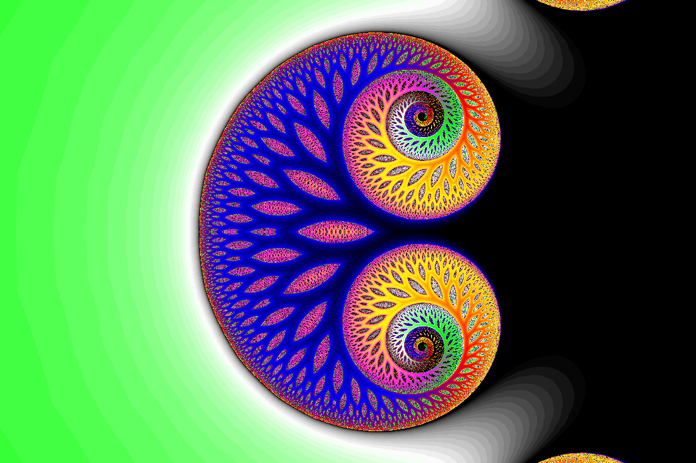
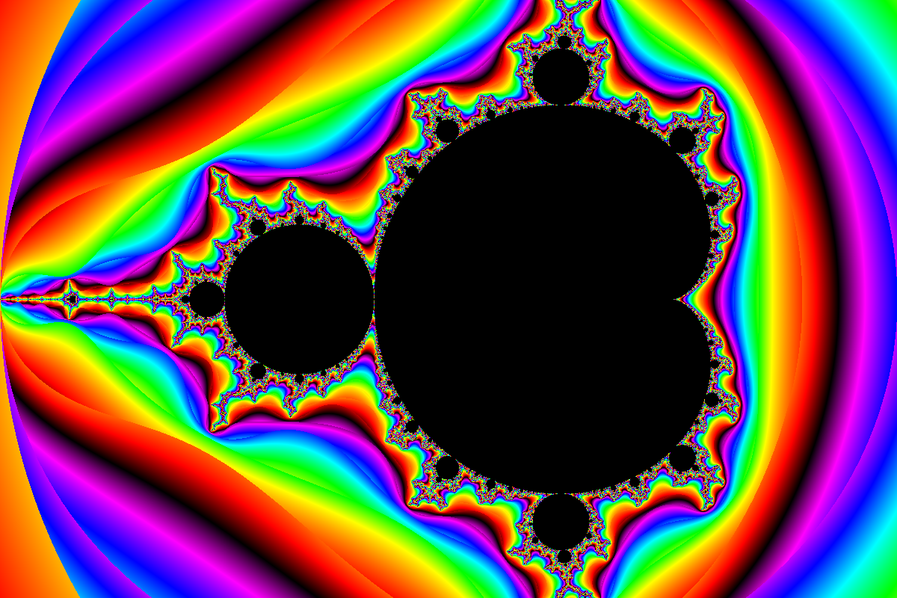
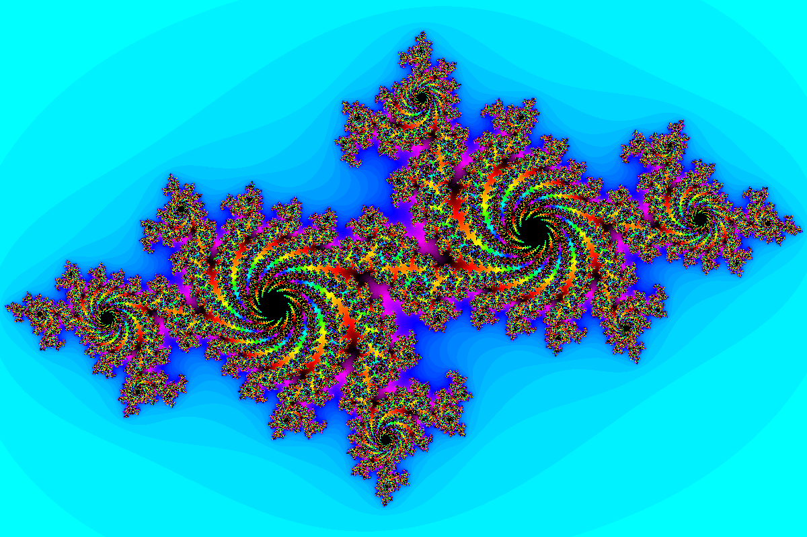
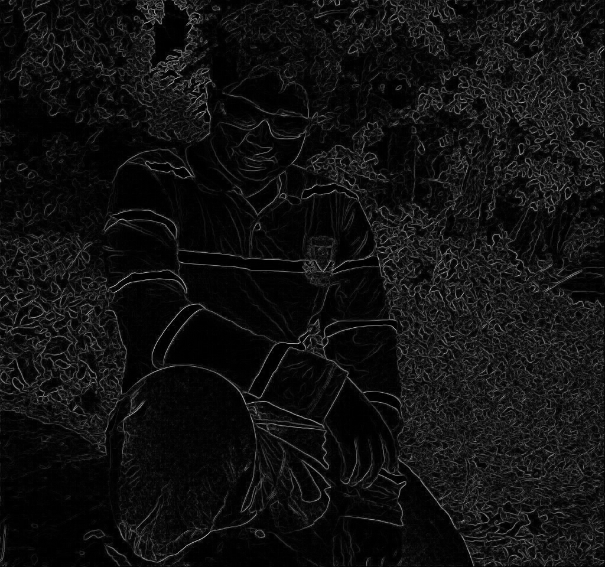
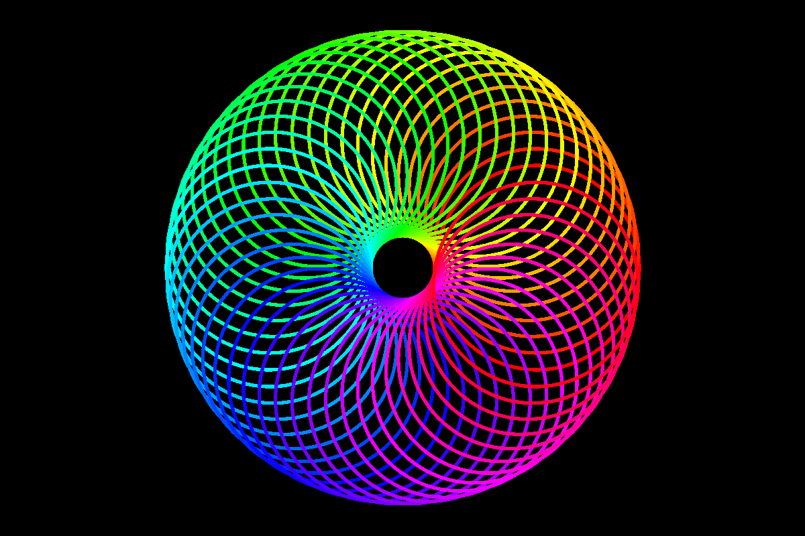
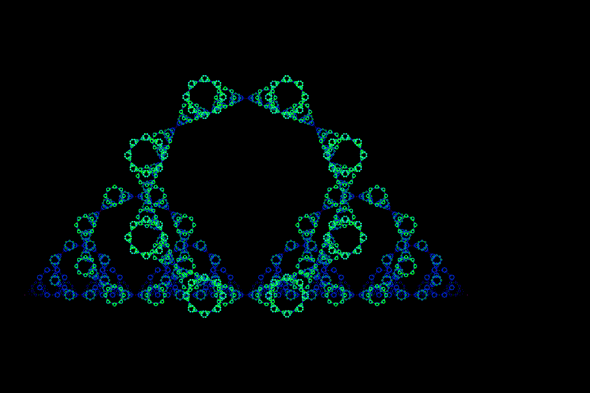
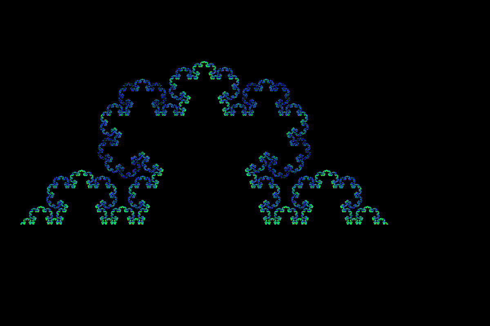
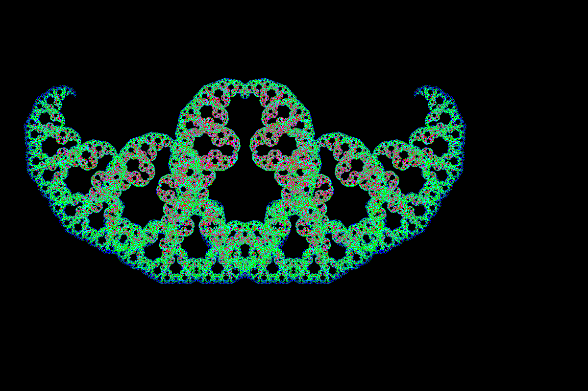
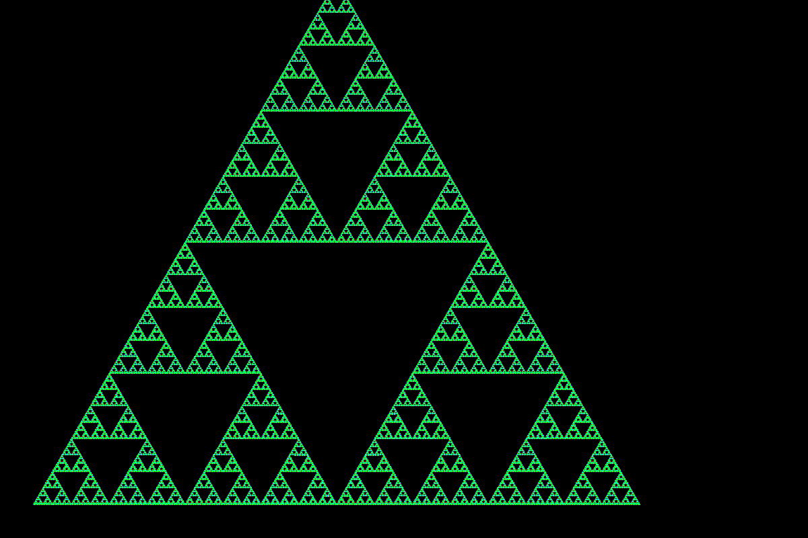

# librvcbitmap

A bitmap image manipulation library written from scratch in C

Features:
1) 24 bit bitmap support
2) Built in complex arithmetic support
3) Low resource usage
4) Well designed abstraction of RGB image

## Getting Started

These instructions will get you a copy of the project up and running on your local machine for development and testing purposes. See deployment for notes on how to deploy the project on a live system.

### Prerequisites

This project is built on Ubuntu 16.04 LTS so
the release for this project can work on any 64 bit Debian distributions.
You require 
1) g++>=4.0
2) deb package system

### Compilation

The source has 'librvcbitmap' directory which is the main library having a makefile.
by opening the folder in the terminal run
```
make
```
to create a deb installer for librvcbitmap which installs a dynamically shared library 
to run the examples in the 'playground' directory.It also has a makefile. To run the
examples in playground just open up a terminal and run
```
make
```
to create a zip containing output of outputs of the example programs.


## Author

* **Rajas Chavadekar** 

## License

This project is licensed under the MIT License - see the [LICENSE](LICENSE) file for details

# Examples of bitmap image creation
## Mandenbrot fractals

### Glynn fractal


### Mandenbrot fractal


### Julia fractal


## Image differentiation


## built in shapes


## L-System fractal group






